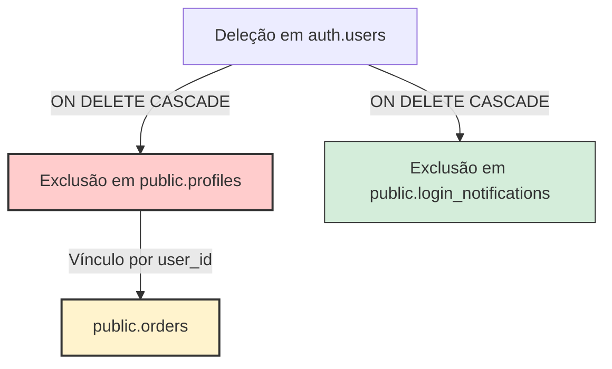
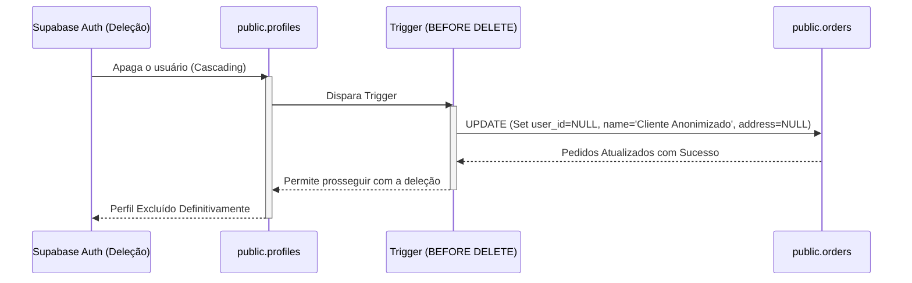

# Relatório Técnico: Homologação LGPD (Art. 18) e Retenção Fiscal no C&R Sushi

Este documento apresenta a análise técnica sobre o comportamento do banco de dados (Supabase/PostgreSQL) da plataforma do **C&R Sushi** referente à solicitação de exclusão de dados por parte dos clientes (conforme o Artigo 18 da LGPD), balanceando com a obrigação legal de retenção do histórico de faturamento para fins fiscais e de auditoria por até 5 anos.

---

## 1. Diagnóstico do Comportamento Atual do Sistema

Com base na inspeção do código e da estrutura da aplicação, identificamos como a exclusão de um usuário se comportaria hoje e onde residem os riscos à conformidade regulatória:



### A. Fluxo de Exclusão da Conta (`auth.users` e `public.profiles`)
*   **Supabase Auth (`auth.users`)**: Quando um cadastro é excluído no painel do Supabase Auth (ou via API Admin do Supabase), o registro correspondente em `public.profiles` que armazena os dados pessoais do cliente (`full_name`, `phone`, `birth_date`) é deletado. Isso ocorre porque o perfil possui uma chave estrangeira referenciando `auth.users(id)` com a diretiva `ON DELETE CASCADE`.
*   **Notificações de Login (`public.login_notifications`)**: Conforme definido no script `create_login_notifications_table.sql` (linha 9), a chave estrangeira possui `ON DELETE CASCADE`, garantindo a eliminação imediata de quaisquer logs de acesso associados àquele usuário. **(Em total conformidade com a LGPD)**.

### B. O Problema Crítico na Tabela de Pedidos (`public.orders`)
A tabela de pedidos atual (`public.orders`) armazena os dados brutas da venda e é vinculada ao cliente pelo campo `user_id`. No modelo atual, há dois cenários possíveis no banco de dados e ambos violam as diretrizes legais se não tratados:

1.  **Cenário de Chave com `ON DELETE CASCADE` (Risco Fiscal)**:
    Se a chave estrangeira `user_id` em `orders` estiver configurada para apagar em cascata, **todos os pedidos do cliente sumirão** quando a conta dele for excluída. Isso representa uma **grave infração à legislação fiscal brasileira**, que exige a guarda dos registros de vendas por até 5 anos para fins de auditoria e declaração de impostos.
2.  **Cenário de Chave com `ON DELETE RESTRICT / NO ACTION` (Trava no Sistema)**:
    Por ser o padrão do Postgres, a chave estrangeira bloqueará a exclusão do usuário. O banco de dados retornará um erro de restrição de chave estrangeira (`foreign key constraint violation`) e o administrador **não conseguirá deletar a conta do cliente**, gerando uma desconformidade técnica imediata com o Art. 18 da LGPD.
3.  **Cenário de Chave com `ON DELETE SET NULL` (Vazamento de PII / LGPD)**:
    Mesmo que o campo `user_id` seja definido como `NULL` automaticamente ao apagar o usuário, a tabela de pedidos do C&R Sushi **duplica dados pessoais brutos diretamente em colunas textuais na linha de cada pedido** no momento da compra (para evitar que alterações cadastrais mudem os dados históricos da entrega):
    *   `customer_name` (Ex: "Atila Bezerra")
    *   `customer_phone` (Ex: "5585999999999")
    *   `address` (Ex: "Rua das Flores, 123, Bairro...")
    
    > [!WARNING]
    > **Vazamento de PII:** Se o `user_id` for anulado mas essas colunas textuais permanecerem intactas, o histórico de pedidos **não estará anonimizado**, pois o nome, o telefone e o endereço completo do cliente continuam gravados nominalmente na tabela `public.orders`. Isso viola diretamente a LGPD!

---

## 2. A Solução Proposta: Trigger de Anonimização Automática

Para solucionar definitivamente o problema sem alterar o código React da aplicação, implementaremos um **Trigger de Banco de Dados** no PostgreSQL.

Ao utilizar um trigger do tipo `BEFORE DELETE` na tabela `public.profiles`, garantimos que:
1.  **Antes** de o perfil do usuário sumir do banco, todos os pedidos vinculados a ele serão atualizados.
2.  O `user_id` será definido como `NULL` (desvinculando-o da conta excluída).
3.  O `customer_name` será anonimizado para `'Cliente Anonimizado'`.
4.  O `customer_phone` será marcado como `'Excluído'` (ou `NULL`).
5.  O campo `address` (que é altamente identificável e sensível) será definido como `NULL`.
6.  **Os dados vitais de faturamento** (`total`, `delivery_fee`, `delivery_type`, `payment_method`, `items` e `created_at`) serão **preservados intactos** para o fluxo de caixa, relatórios estatísticos e auditoria.

### Arquitetura de Anonimização LGPD:



---

## 3. Script SQL de Implantação

Copie o script SQL abaixo e execute-o diretamente no **SQL Editor** do Supabase para aplicar a solução instantaneamente:

```sql
-- =========================================================================
-- SCRIPT DE CONFORMIDADE LGPD (ART. 18) - ANonimização de Histórico de Pedidos
-- C&R SUSHI (NEXT.JS & SUPABASE)
-- =========================================================================

-- 1. Criar a função que realiza a anonimização dos pedidos
CREATE OR REPLACE FUNCTION public.anonymize_user_orders_before_delete()
RETURNS TRIGGER AS $$
BEGIN
  -- Atualizar os pedidos vinculados ao perfil que será deletado
  UPDATE public.orders
  SET 
    user_id = NULL,                       -- Rompe o vínculo relacional
    customer_name = 'Cliente Anonimizado', -- Remove o Nome PII
    customer_phone = 'Excluído',           -- Remove o Telefone PII
    address = NULL                        -- Limpa o endereço completo (Dado pessoal sensível)
  WHERE user_id = OLD.id;

  -- Retorna OLD para permitir que o registro do perfil seja deletado normalmente
  RETURN OLD;
END;
$$ LANGUAGE plpgsql SECURITY DEFINER;

-- 2. Associar a função a um Trigger BEFORE DELETE na tabela de perfis
DROP TRIGGER IF EXISTS trigger_anonymize_user_orders ON public.profiles;
CREATE TRIGGER trigger_anonymize_user_orders
BEFORE DELETE ON public.profiles
FOR EACH ROW
EXECUTE FUNCTION public.anonymize_user_orders_before_delete();

-- 3. Comentário técnico explicativo para auditoria
COMMENT ON FUNCTION public.anonymize_user_orders_before_delete() IS 'Anonimiza dados pessoais em pedidos antigos ao deletar o perfil do cliente para atender ao Art. 18 da LGPD';
```

### Por que esta solução é 100% segura?
*   **Segurança com Relações Restritivas (`RESTRICT` / `NO ACTION`)**: Como o trigger roda com a instrução `BEFORE DELETE`, a alteração dos pedidos ocorre **frações de milissegundo antes** de o perfil ser removido. Isso significa que, no exato momento em que o Postgres vai validar a integridade da chave estrangeira, a referência `orders.user_id` já é `NULL`, evitando qualquer erro de bloqueio de chave estrangeira!
*   **Security Definer**: A função é declarada como `SECURITY DEFINER`, o que significa que ela roda com privilégios de superusuário (`postgres`), ignorando políticas de RLS ou restrições que um cliente comum teria na tabela de pedidos ao tentar alterar dados históricos.

---

## 4. Próximos Passos recomendados para Homologação LGPD

Além do trigger de pedidos, para garantir conformidade total na homologação da plataforma C&R Sushi, avalie os seguintes pontos:

1.  **Exclusão de Cupons Vinculados (`public.coupons`)**:
    Clientes podem ter cupons de fidelidade (`loyalty`) ou aniversário (`birthday`) vinculados a seus IDs no banco. 
    *   *Recomendação*: Garanta que a coluna `user_id` na tabela de cupons possua a regra `ON DELETE CASCADE` ou crie uma instrução no mesmo trigger acima para deletar/anular cupons personalizados pendentes associados ao usuário:
        ```sql
        DELETE FROM public.coupons WHERE user_id = OLD.id;
        ```
2.  **Consentimento no Cadastro**:
    Certifique-se de que no fluxo de criação de conta (`UserAuth.tsx`) haja um checkbox obrigatório onde o cliente aceita explicitamente os **Termos de Uso** e a **Política de Privacidade** atualizada.
3.  **Logs Administrativos de Deleção**:
    A LGPD exige que a plataforma consiga provar que atendeu à requisição de exclusão do titular caso seja questionada pela ANPD (Autoridade Nacional de Proteção de Dados).
    *   *Recomendação*: Ao efetuar a deleção, mantenha um log genérico e anônimo em um sistema externo ou tabela de log administrativo (ex: *"ID XXXXXXXXX deletado às YYYY-MM-DD em conformidade com o Art. 18"*), sem armazenar qualquer dado pessoal do cliente que acabou de ser excluído.
