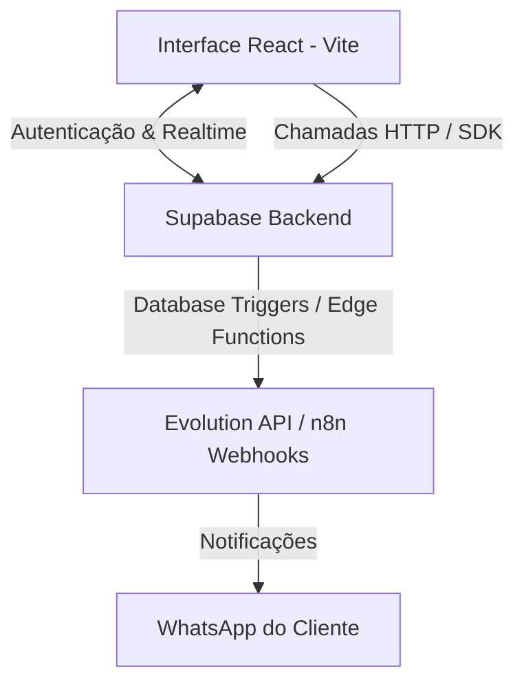

# Análise Técnica do Projeto: C&R Sushi

Este documento contém a análise completa do projeto **C&R Sushi Delivery**. Ele serve como uma referência técnica permanente para evitar reanálises completas do repositório a cada nova sessão de desenvolvimento.

---

## 1. Visão Geral do Sistema
O **C&R Sushi** é uma plataforma de e-commerce e delivery voltada para o comércio de sushi e produtos relacionados. O sistema é composto por:
1. **Interface do Cliente**: Escolha de cidade/filial, visualização de produtos/destaques por categorias, carrinho de compras, sistema de cupons, checkout (Pix, cartão, dinheiro), rastreamento do status de entrega em tempo real e perfil do usuário.
2. **Painel do Administrador**: Gerenciamento de pedidos em tempo real, controle do catálogo de produtos e destaques visuais, ativação de cidades de atendimento, controle de cupons/bonificações, disparos de campanhas de marketing pelo WhatsApp e configurações da identidade visual da loja.
3. **Mecanismo de Automação & Mensageria**: Conexão entre o banco de dados (Supabase), Edge Functions e workflows no **n8n** para envio automático de notificações de pedidos e cupons via WhatsApp.

---

## 2. Arquitetura e Stack Tecnológica

O projeto adota uma arquitetura Serverless moderna e reativa:

### Frontend
- **Framework & Linguagem**: React (v18) com TypeScript, empacotado pelo Vite.
- **Estilização**: Tailwind CSS (utility-first) com suporte a temas (claro/escuro/sistema) controlado via [ThemeContext.tsx](file:///c:/Users/vanes/OneDrive/Área de Trabalho/PROJETOS/CR SUSHI 01 03/CR SUSHI EDIT/src/contexts/ThemeContext.tsx).
- **Componentes de UI**: Baseados em componentes reutilizáveis sob medida e elementos do `shadcn/ui` (como [button.tsx](file:///c:/Users/vanes/OneDrive/Área de Trabalho/PROJETOS/CR SUSHI 01 03/CR SUSHI EDIT/src/components/ui/button.tsx)).
- **Roteamento**: O roteamento é simulado internamente através de um estado de visualização (`currentView`) no componente central [App.tsx](file:///c:/Users/vanes/OneDrive/Área de Trabalho/PROJETOS/CR SUSHI 01 03/CR SUSHI EDIT/src/App.tsx) (`'location' | 'home' | 'admin' | 'auth' | 'tracking'`).
- **Formulários & Notificações**: `react-hook-form` para gerenciar entradas e `react-hot-toast` para avisos visuais.

### Backend & Banco de Dados (Supabase)
- **Supabase Auth**: Autenticação nativa por e-mail/senha com persistência de sessão.
- **PostgreSQL Database**: Tabelas relacionais com Row Level Security (RLS) habilitado.
- **Supabase Realtime**: Canais ativos para escutar inserções e alterações em tempo real (como novos acessos de clientes e novos pedidos).
- **Edge Functions**:
  - `whatsapp-router`: Roteador central que recebe requisições de saída (notificações de pedidos do sushi, marketing, agendamentos) e roteia para o n8n ou processa mensagens de entrada (Evolution API -> PIX).
  - `order-status-update`: Dispara atualizações de estado nos pedidos.

### Integrações Externas (n8n & Evolution API)
- Localizados no diretório [n8n_workflows](file:///c:/Users/vanes/OneDrive/Área de Trabalho/PROJETOS/CR SUSHI 01 03/CR SUSHI EDIT/n8n_workflows/):
  - [whatsapp_bonification_and_orders_unified.json](file:///c:/Users/vanes/OneDrive/Área de Trabalho/PROJETOS/CR SUSHI 01 03/CR SUSHI EDIT/n8n_workflows/whatsapp_bonification_and_orders_unified.json): Centraliza o disparo de mensagens para o WhatsApp.
  - Outros arquivos lidam com cupons de fidelidade e retornos com CORS.

---

## 3. Modelo de Dados (Database Schema)

Os tipos de dados TypeScript estão declarados em [types.ts](file:///c:/Users/vanes/OneDrive/Área de Trabalho/PROJETOS/CR SUSHI 01 03/CR SUSHI EDIT/src/types.ts).

### Tabelas Principais do Banco de Dados
1. **`profiles`**
   - Vinculado a `auth.users(id)` com `ON DELETE CASCADE`.
   - Armazena dados cadastrais: `id`, `full_name`, `phone`, `birth_date`, `role` (`'customer' | 'admin'`), `purchase_count`.
2. **`orders`**
   - Histórico de pedidos de entrega/retirada.
   - Colunas textuais redundantes (`customer_name`, `customer_phone`, `address`) para manter o registro histórico intacto mesmo em caso de alteração no cadastro do cliente.
   - Vinculado a `profiles.id` por `user_id`.
3. **`coupons`**
   - Cupons de desconto: aniversário, fidelidade ou promocionais.
   - Controlado por limites de uso (`usage_limit`, `usage_count`), flag ativa (`active`) e pendências de aprovação (`is_pending_admin_approval`).
4. **`cities`**
   - Cidades de atendimento disponíveis para seleção pelo cliente.
5. **`operating_hours`**
   - Horários de abertura (`open_time` e `close_time`) para cada dia da semana (`day_of_week` de 0 a 6).
6. **`highlights`**
   - Produtos destacados na página inicial com configurações visuais de cor de borda (`border_color`), tamanho da sombra (`shadow_size`) e ordem de exibição (`order_index`).
7. **`login_notifications`**
   - Registros de acesso de clientes que disparam alertas sonoros e visuais no painel de administração em tempo real.
8. **`campanha` e `fila_disparo`**
   - Filas de processamento para envio de mensagens em lote (WhatsApp marketing).

### LGPD (Conformidade Art. 18) e Retenção Fiscal
Em conformidade com a legislação brasileira, foi definida a seguinte estratégia:
*   A exclusão do perfil do usuário em `profiles` **não apaga** os seus pedidos correspondentes da tabela `orders` devido à exigência fiscal de retenção por 5 anos.
*   Em vez disso, um trigger `BEFORE DELETE ON public.profiles` executa a função `anonymize_user_orders_before_delete()` que:
    1. Define `user_id = NULL` na tabela `orders`.
    2. Altera `customer_name` para `'Cliente Anonimizado'`.
    3. Altera `customer_phone` para `'Excluído'`.
    4. Altera `address` para `NULL`.
    5. Preserva os valores de faturamento (`total`, `delivery_fee`, `items`, etc.).
*   Os logs de acesso (`login_notifications`) e cupons individuais pendentes são excluídos via cascade ou deleção direta.

---

## 4. Lógicas Críticas de Negócio

### A. Horário de Funcionamento & Pré-Pedido
Controlado pelo hook [useStoreStatus.ts](file:///c:/Users/vanes/OneDrive/Área de Trabalho/PROJETOS/CR SUSHI 01 03/CR SUSHI EDIT/src/hooks/useStoreStatus.ts):
- O sistema busca os limites da tabela `operating_hours` para o dia corrente.
- Se o horário atual estiver fora do intervalo da loja, o status `isStoreOpen` é definido como falso.
- **Pré-Pedido**: Se a loja estiver fechada mas o horário do cliente estiver entre **07:00 e 17:00**, ele pode efetuar pré-pedidos. O banner de aviso e o modal [PreOrderModal.tsx](file:///c:/Users/vanes/OneDrive/Área de Trabalho/PROJETOS/CR SUSHI 01 03/CR SUSHI EDIT/src/components/PreOrderModal.tsx) informam sobre o agendamento da entrega.

### B. Proxy de Notificação WhatsApp
Para contornar restrições de CORS e SSL no navegador do usuário, as mensagens para o WhatsApp são transmitidas usando o roteador [whatsapp-router](file:///c:/Users/vanes/OneDrive/Área de Trabalho/PROJETOS/CR SUSHI 01 03/CR SUSHI EDIT/supabase/functions/whatsapp-router/index.ts):
- O cliente invoca a Edge Function contendo as chaves necessárias.
- A Edge Function lê a variável de ambiente `N8N_DELIVERY_WEBHOOK_URL` ou `N8N_MARKETING_WEBHOOK_URL` configurada no Supabase e redireciona a chamada para o n8n, injetando a informação da instância correspondente da Evolution API (`C7R`).

### C. Alertas em Tempo Real no Painel Admin
No arquivo [AdminPanel.tsx](file:///c:/Users/vanes/OneDrive/Área de Trabalho/PROJETOS/CR SUSHI 01 03/CR SUSHI EDIT/src/components/AdminPanel.tsx):
- Habilita-se um canal de escuta em tempo real no Supabase (`login_notifications`).
- Sempre que um usuário faz login (e este usuário não é o próprio administrador atual), o painel dispara o som `/assets/login-sound.mp3` e ativa um modal flutuante indicando o acesso do cliente.

---

## 5. Dívidas Técnicas Identificadas

De acordo com o arquivo de dívida técnica do repositório, há oportunidades de melhoria arquitetural que devem ser priorizadas em futuras refatorações:
1. **Sobrecarga de Estado no [App.tsx](file:///c:/Users/vanes/OneDrive/Área de Trabalho/PROJETOS/CR SUSHI 01 03/CR SUSHI EDIT/src/App.tsx)**:
   - Acumula lógica de autenticação, carrinho de compras, sincronização de localStorage, rotas internas, e requisições paralelas.
   - *Solução futura*: Implementar Contextos dedicados (`CartContext`, `AuthContext`) ou biblioteca de gerenciamento leve (como Zustand), além de utilizar um roteador formal (ex: RouterProvider do `react-router-dom`).
2. **Duplicidade em Chamadas de API**:
   - Algumas consultas utilizam o SDK cliente do Supabase (`supabase.from()`), enquanto outras usam o `fetch` nativo configurado com headers manuais.
   - *Solução futura*: Padronizar todas as chamadas em hooks reutilizáveis (ex: `useFetchCities`, `useSettings`).
3. **Persistência Repetitiva em LocalStorage**:
   - Vários estados efetuam verificação de `typeof window !== 'undefined'` de forma avulsa.
   - *Solução futura*: Encapsular em um custom hook genérico `useLocalStorage`.

---

## 6. Atalhos de Arquivos Importantes para Consulta

Para navegação rápida, consulte os seguintes módulos do projeto:

### Componentes de Visualização (Clientes)
- [HomePage.tsx](file:///c:/Users/vanes/OneDrive/Área de Trabalho/PROJETOS/CR SUSHI 01 03/CR SUSHI EDIT/src/components/HomePage.tsx): Componente principal do catálogo e layout.
- [Cart.tsx](file:///c:/Users/vanes/OneDrive/Área de Trabalho/PROJETOS/CR SUSHI 01 03/CR SUSHI EDIT/src/components/Cart.tsx): Fluxo de sacola de compras e finalização do pedido.
- [LocationSelect.tsx](file:///c:/Users/vanes/OneDrive/Área de Trabalho/PROJETOS/CR SUSHI 01 03/CR SUSHI EDIT/src/components/LocationSelect.tsx): Modal de seleção de cidade.
- [UserProfile.tsx](file:///c:/Users/vanes/OneDrive/Área de Trabalho/PROJETOS/CR SUSHI 01 03/CR SUSHI EDIT/src/components/UserProfile.tsx): Tela com informações de cupons e histórico de compras.

### Componentes de Administração
- [AdminPanel.tsx](file:///c:/Users/vanes/OneDrive/Área de Trabalho/PROJETOS/CR SUSHI 01 03/CR SUSHI EDIT/src/components/AdminPanel.tsx): Roteador do painel administrativo.
- [AdminOrders.tsx](file:///c:/Users/vanes/OneDrive/Área de Trabalho/PROJETOS/CR SUSHI 01 03/CR SUSHI EDIT/src/components/admin/AdminOrders.tsx): Gestão de pedidos recebidos.
- [AdminSettings.tsx](file:///c:/Users/vanes/OneDrive/Área de Trabalho/PROJETOS/CR SUSHI 01 03/CR SUSHI EDIT/src/components/admin/AdminSettings.tsx): Gerenciador de preferências da aplicação.
- [AdminMarketing.tsx](file:///c:/Users/vanes/OneDrive/Área de Trabalho/PROJETOS/CR SUSHI 01 03/CR SUSHI EDIT/src/components/admin/AdminMarketing.tsx): Campanhas e envios WhatsApp.
- [AdminBonificationCoupons.tsx](file:///c:/Users/vanes/OneDrive/Área de Trabalho/PROJETOS/CR SUSHI 01 03/CR SUSHI EDIT/src/components/admin/AdminBonificationCoupons.tsx): Aprovação de cupons especiais.

---
*Este arquivo deve ser atualizado sempre que novas alterações estruturais forem consolidadas no repositório.*
